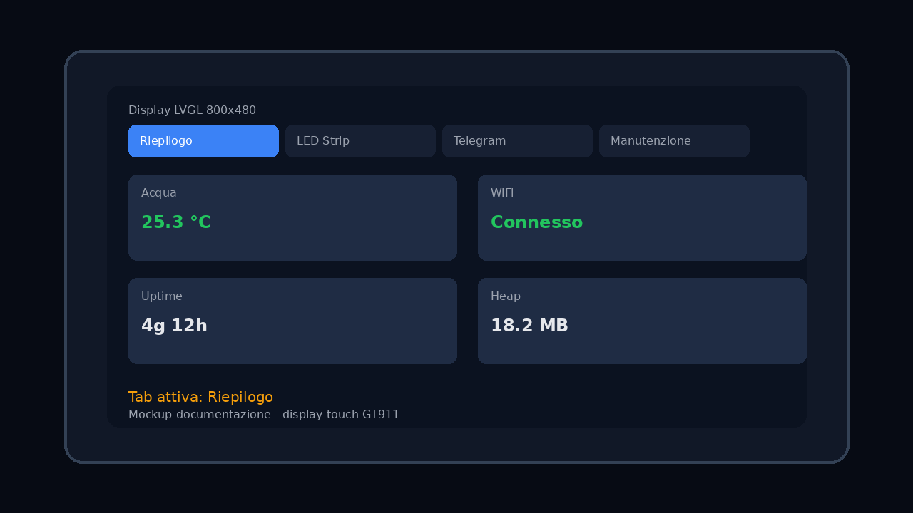
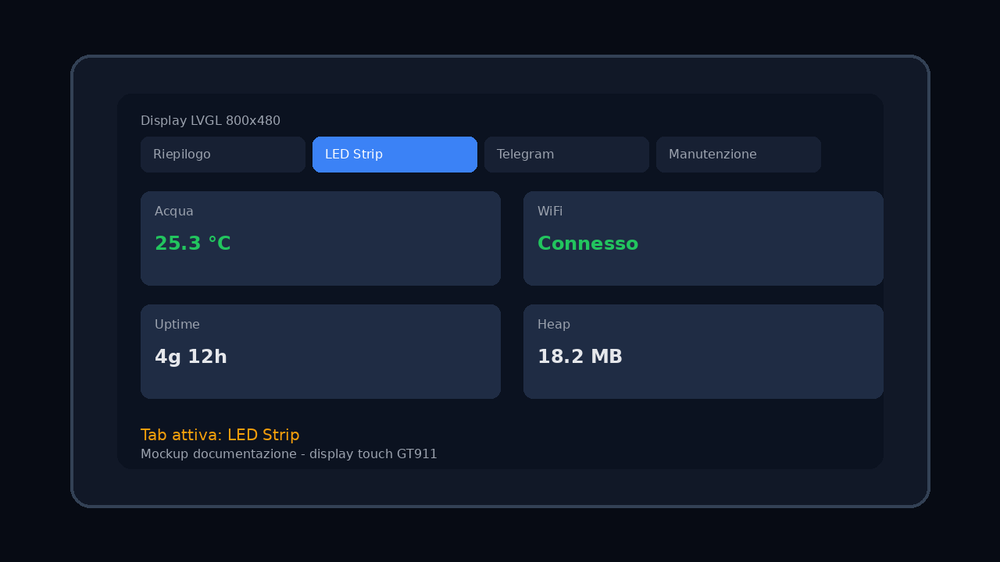
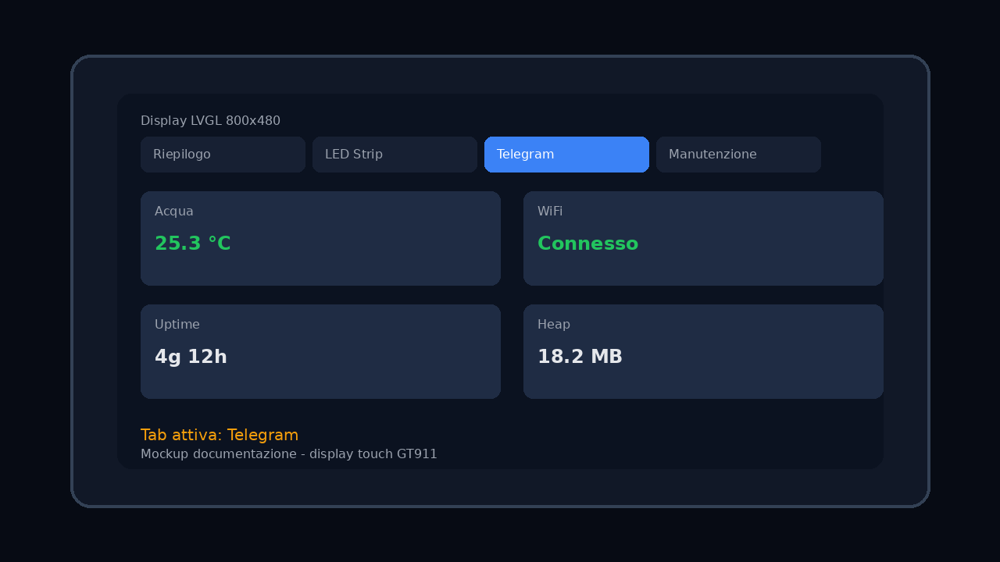
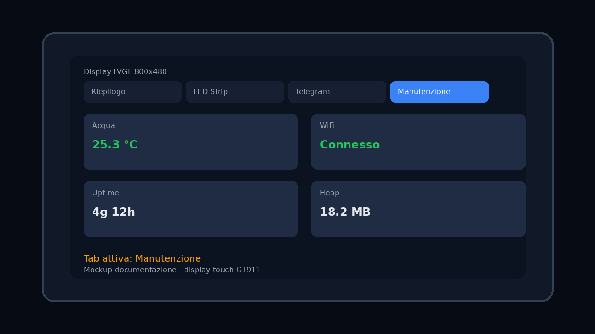

# 🐟 Aquarium Controller – ESP32-P4

Controller completo per acquario su **Waveshare ESP32-P4-WiFi6** con:
- gestione **LED WS2812B** (scene, preset, schedule)
- monitoraggio **temperatura DS18B20** con storico e CSV
- controllo **4 relè** manuale (programmazione oraria riservata alla **CO₂**)
- notifiche **Telegram** (allarmi, promemoria, test, report)
- modulo **Auto-Heater** e gestione **CO₂**
- dashboard locale su **Display LVGL touch** e **Web UI REST**

> Stack: ESP-IDF + ESP Hosted (P4 + C6) + LVGL + HTTP server embedded.

---

## 📸 Screenshot aggiornati

### Display UI (LVGL, 4 tab)

| Riepilogo | LED Strip |
|---|---|
|  |  |

| Telegram | Manutenzione |
|---|---|
|  |  |

### Web UI (desktop + mobile)

| Riepilogo | LED Strip |
|---|---|
|  |  |

| Telegram | Manutenzione |
|---|---|
|  |  |

| Mobile |
|---|
|  |

---

## ✨ Funzionalità principali

- **WiFi STA + AP fallback** (captive portal di configurazione)
- **Display touch 800x480** con tab sincronizzati con la Web UI
- **Web dashboard** con controlli in tempo reale
- **REST API JSON** per integrazione esterna
- **LED control avanzato**
  - on/off rapido
  - RGB + luminosità
  - schedule alba/tramonto
  - preset e scene
- **Temperatura acqua**
  - polling periodico DS18B20
  - media mobile
  - storico giornaliero
  - esportazione CSV
- **Relè**
  - comando manuale
  - nomi personalizzati
- **CO₂**
  - programmazione oraria dedicata (via schedule luci + pre/post ritardi)
- **Telegram bot**
  - eventi relè
  - allarmi temperatura
  - test messaggio
  - promemoria cambio acqua/fertilizzante
- **Manutenzione**
  - OTA da URL
  - DuckDNS
  - fuso orario POSIX
  - stato heap/uptime/rete
- **HTTPS opzionale** (certificato embedded)

---

## 🧱 Architettura

### Hardware target
- **MCU principale**: ESP32-P4
- **Coprocessore**: ESP32-C6 (WiFi/BLE via SDIO)
- **Board**: Waveshare ESP32-P4-WiFi6

### Flusso di avvio (semplificato)
1. NVS init
2. WiFi manager init
3. timezone + SNTP
4. init moduli (LED, sensore, Telegram, relè, heater, CO₂, DuckDNS)
5. init display in task dedicato su **CPU1**
6. avvio Web server
7. loop applicativo (tick moduli + refresh UI)

### Moduli principali (`main/`)
- `main.c` – orchestrazione bootstrap e loop
- `wifi_manager.*` – STA/AP e provisioning
- `web_server.*` – dashboard + endpoint REST
- `display_driver.*` – MIPI DSI + touch GT911 + LVGL
- `display_ui.*` – UI a 4 tab
- `led_controller.*`, `led_schedule.*`, `led_scenes.*`
- `temperature_sensor.*`, `temperature_history.*`
- `relay_controller.*`
- `telegram_notify.*`
- `auto_heater.*`, `co2_controller.*`
- `duckdns.*`, `ota_update.*`, `timezone_manager.*`

---

## 📌 Pin di default (Kconfig)

### Periferiche
- LED strip data: **GPIO 8**
- DS18B20 data: **GPIO 21**
- Relay 1..4: **GPIO 22 / 23 / 24 / 25**

### Display / touch
- Backlight: **GPIO 26**
- LCD reset: **GPIO 27**
- Touch SDA/SCL: **GPIO 7 / 9**
- Touch INT/RST: **-1 / -1** (opzionali)

> Tutti i valori sono modificabili da `idf.py menuconfig`.

---

## ⚙️ Configurazione

### Prerequisiti
- ESP-IDF installato e attivato in shell
- Toolchain per target ESP32-P4

### Build & flash
```bash
idf.py set-target esp32p4
idf.py menuconfig
idf.py build
idf.py -p /dev/ttyACM0 flash monitor
```

### Configurazioni importanti (`menuconfig`)
- **Aquarium WiFi Settings**
- **Aquarium Timezone Settings**
- **Aquarium LED Strip Settings**
- **Aquarium Temperature Sensor Settings**
- **Aquarium Relay Settings**
- **Aquarium MIPI DSI Display Settings**
- **Aquarium HTTPS Settings**

---

## 🌐 REST API (principali endpoint)

### Sistema
- `GET /api/health`
- `GET /api/status`

### LED
- `GET /api/leds`
- `POST /api/leds`
- `GET /api/led_schedule`
- `POST /api/led_schedule`
- `GET /api/led_presets`
- `POST /api/led_presets`

### Temperatura
- `GET /api/temperature`
- `GET /api/temperature_history`
- `GET /api/temperature/export.csv`

### Telegram
- `GET /api/telegram`
- `POST /api/telegram`
- `POST /api/telegram_test`
- `POST /api/telegram_wc`
- `POST /api/telegram_fert`

### Relè / Manutenzione
- `GET /api/relays`
- `POST /api/relays`
- `GET /api/heater`
- `POST /api/heater`
- `GET /api/co2`
- `POST /api/co2`
- `GET /api/duckdns`
- `POST /api/duckdns`
- `POST /api/duckdns_update`
- `POST /api/ota`
- `GET /api/ota_status`
- `GET /api/timezone`
- `POST /api/timezone`

---

## 🔒 Sicurezza

- Se abiliti HTTPS (`AQUARIUM_HTTPS_ENABLE`), usa connessioni TLS sulla LAN.
- Certificato self-signed predefinito: il browser mostrerà warning iniziale.
- Per ambienti esposti su Internet, consigliato reverse proxy con certificati validi.

---

## 🛠️ Troubleshooting rapido

- **Display nero** → controllare cablaggio MIPI/backlight/reset.
- **WiFi non connesso** → verificare SSID/password o usare AP setup.
- **Telegram non invia** → controllare token/chat ID e ora SNTP sincronizzata.
- **Temperatura nulla** → verificare DS18B20 e pull-up 4.7k.
- **OTA fallisce** → verificare URL binario, rete e spazio partizioni.

---

## 📁 Struttura repository

```text
.
├── CMakeLists.txt
├── partitions.csv
├── sdkconfig.defaults
├── README.md
├── docs/
│   └── screenshots/
└── main/
    ├── Kconfig.projbuild
    ├── idf_component.yml
    ├── main.c
    ├── web_server.c
    ├── display_driver.c
    ├── display_ui.c
    └── ...
```

---

## 📄 Licenza

Questo progetto è distribuito con licenza **MIT**.
