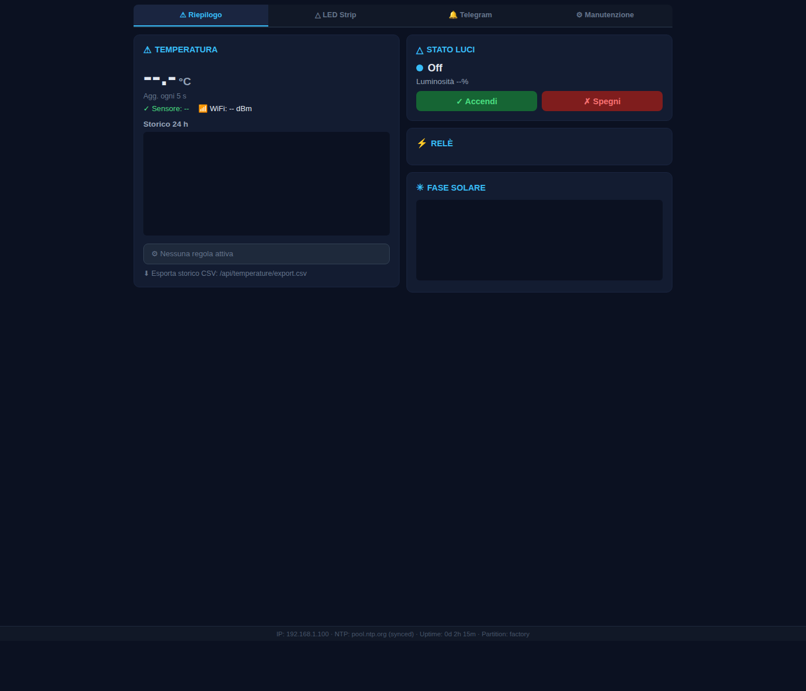
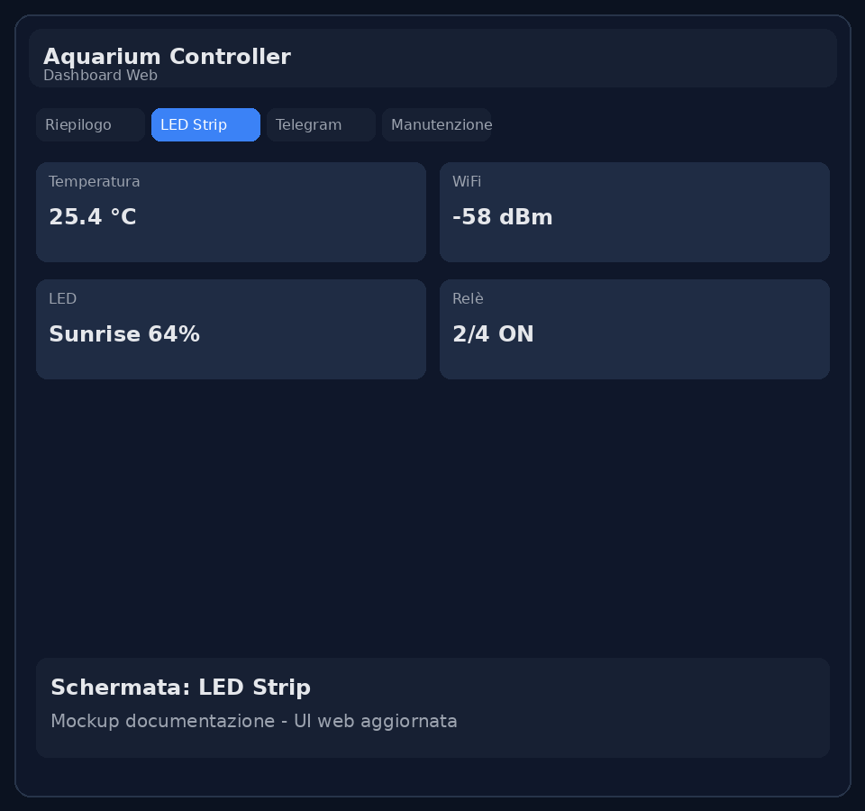
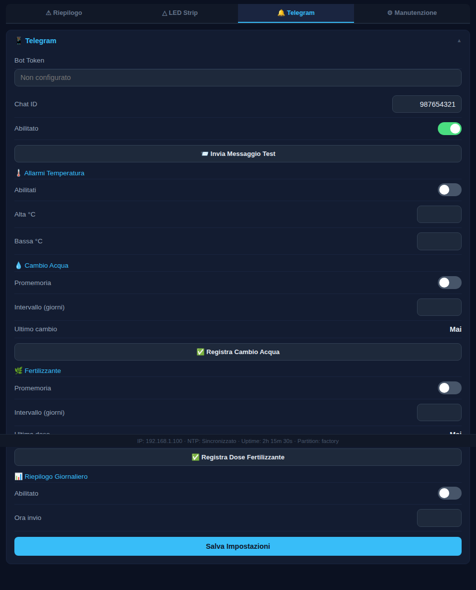
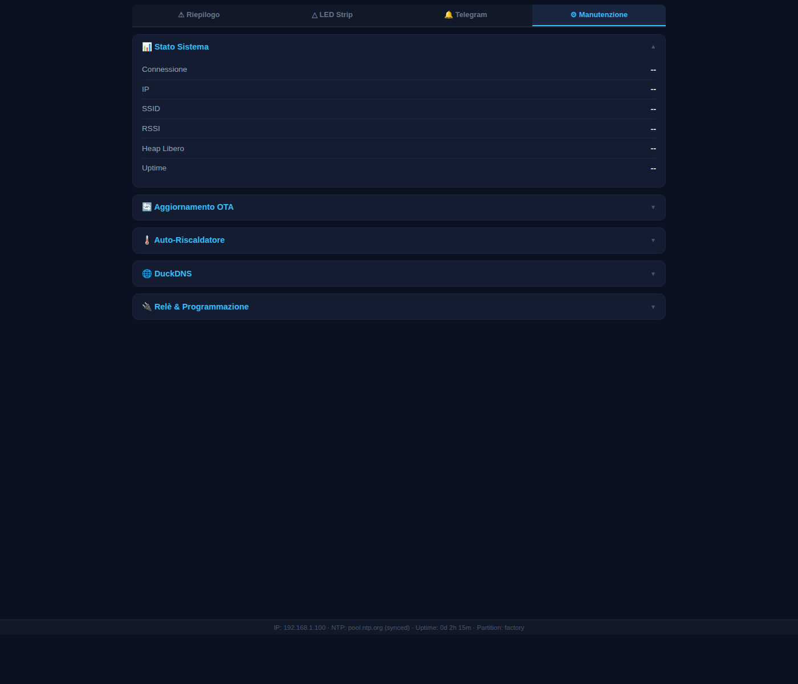
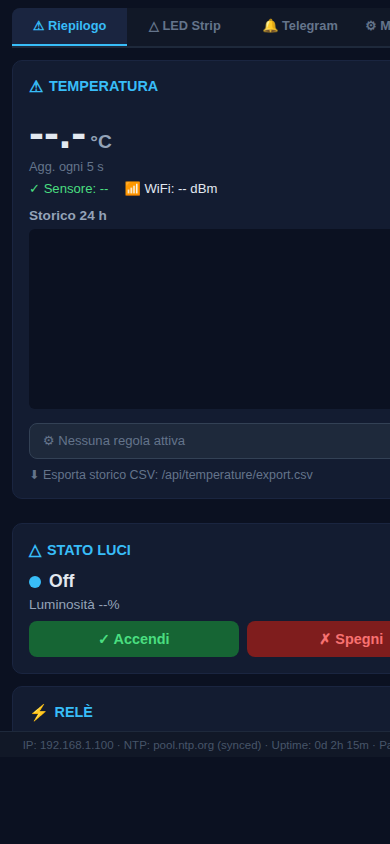

# 🐟 Aquarium Controller – ESP32-P4

Controller completo per acquario su **Waveshare ESP32-P4-WiFi6** con:
- gestione **LED WS2812B** (scene, preset, schedule)
- monitoraggio **temperatura DS18B20** con storico e CSV
- controllo **4 relè** manuale (programmazione oraria riservata alla **CO₂**)
- notifiche **Telegram** (allarmi, promemoria, test, report)
- modulo **Auto-Heater** e gestione **CO₂**
- **Web UI REST** locale
- **Touch Display UI** LVGL v9 su display 720×720 (Waveshare 4-DSI-TOUCH-A)

> Stack: ESP-IDF + ESP Hosted (P4 + C6) + HTTP server embedded.

---

## 📸 Screenshot aggiornati

### Web UI (desktop + mobile)

| Riepilogo | LED Strip |
|---|---|
|  |  |

| Telegram | Manutenzione |
|---|---|
|  |  |

| Mobile |
|---|
|  |

---

## 🖥️ Touch Display UI

Il display circolare **Waveshare 4-DSI-TOUCH-A** (720 × 720, IPS, MIPI-DSI, touch capacitivo GT911) mostra
una dashboard LVGL v9 a **5 tab** con stile _dark glassmorphism_ ispirato alle moderne home-automation UI.

### Palette & stile

| Token | Valore | Utilizzo |
|---|---|---|
| `C_BG` | `#080d18` | Sfondo pagina – navy profondo |
| `C_CARD` | `#0f1729` | Superficie card – senza bordo, `r=14` |
| `C_ACCENT` | `#06b6d4` | Teal – azioni primarie, tab attivo (underline) |
| `C_ORANGE` | `#f97316` | Temperatura / riscaldatore |
| `C_ON` | `#22c55e` | ON / attivo (con glow shadow) |
| `C_ERR` | `#f87171` | Errore / OFF pericoloso |
| `C_PINK` | `#e879f9` | CO₂ / preset |

- **Bottoni** pill-shaped (`LV_RADIUS_CIRCLE`, h=56 px) con shadow glow sui pulsanti accent
- **Switch** con alone verde (`shadow`) quando attivi
- **Slider** a 6 px con knob luminoso
- **Tab bar** in fondo: sfondo nero assoluto, tab attivo con bordo teal da 3 px in cima

---

### Tab 1 – 🏠 Home

Panoramica in tempo reale con aggiornamento ogni 2 s.

```
┌─────────────────────────────────────────────────────────┐
│            ╭──── ARC GAUGE (270°, arancione) ────╮      │
│           ╭│              25.4°C                 │╮      │
│           ││  ←────────────────────────────→     ││      │
│           ╰│          Temperatura                │╯      │
│            ╰────────────────────────────────────╯       │
│                                                          │
│  ┌─ Illuminazione ──────────────────────── Accese 75% ─┐ │
│  │  ████████████████████  (swatch colore LED)          │ │
│  │  [ ▶  Accendi ]             [ ■  Spegni ]           │ │
│  └──────────────────────────────────────────────────────┘ │
│                                                          │
│  ┌─ ⚙ Relè ───────────────────────────────────────────┐  │
│  │  ● Filtro        [ ○ ]   ● Riscaldatore  [ ● ]     │  │
│  │  ● CO₂           [ ○ ]   ● Pompa         [ ● ]     │  │
│  └──────────────────────────────────────────────────────┘  │
└─────────────────────────────────────────────────────────┘
```

- **Arc gauge**: verde se 24–28 °C, arancione fuori range; etichetta Montserrat 28 pt centrata
- **Coloured dots**: ogni relè ha il suo colore (teal / arancio / verde / rosa)
- **Swatch LED**: rispecchia il colore RGB corrente della strip

---

### Tab 2 – 💡 LED

Controllo manuale + programmazione schedule + preset.

```
┌─ ✎ Controllo Manuale ─────────────────── [switch] ─┐
│  Lum. ──────────────────────────────  75%           │
│  ████████████████  (preview colore)                 │
│  R ●══════════════════════════════════○  220        │
│  G ●═══════════════════════════  ○  180             │
│  B ●═══════════  ○  100                             │
│             [     Applica     ]                     │
└──────────────────────────────────────────────────────┘
┌─ ⚡ Programmazione ─────────────────── [switch] ──┐
│  Accensione  [ − ] 08 [ + ] : [ − ] 00 [ + ]     │
│  Spegnimento [ − ] 22 [ + ] : [ − ] 00 [ + ]     │
│  Ramp (min)  [ − ] 30 [ + ]                      │
│  Luminosità  ●══════════════════════════○         │
│  Colore giorno  R ●═══════○   G ●═══○  B ●═══○   │
│  Pausa mezzogiorno  ─────────────────── [switch]  │
│             [ Salva Programma ]                   │
└──────────────────────────────────────────────────┘
┌─ Preset ──────────────────────────────────────────┐
│  [ Alba Tropicale ]  [ Giornata Piena ]            │
│  [ Tramonto ]        [ Notte Blu ]                 │
└───────────────────────────────────────────────────┘
```

---

### Tab 3 – 🔌 Relè

Quattro card (una per relè): tocca il nome per rinominare con tastiera on-screen.

```
┌── [ Filtro   ✎ ] ──────────────────── [●══ ON ══●] ─┐
│
├── [ Riscaldatore ✎ ] ──────────────── [○══ OFF ══○] ─┤
│
├── [ CO₂ ✎ ] ────────────────────────── [●══ ON ══●] ─┤
│
└── [ Pompa ✎ ] ──────────────────────── [○══ OFF ══○] ─┘
```

- Tap sul nome → modal di rinomina con tastiera LVGL e overlay semitrasparente

---

### Tab 4 – ⚙ Config

Configurazione parametri di automazione (salvati in NVS).

```
┌─ ⚠ Riscaldatore Auto ──────────────── [switch] ──┐
│  Relè (1-4)   [ − ] 2 [ + ]                      │
│  Target (°C)  [ − ] 26.0 [ + ]                   │
│  Isteresi     [ − ] 0.5 [ + ]                    │
│         [ Salva Riscaldatore ]                    │
└───────────────────────────────────────────────────┘
┌─ 🔄 CO₂ Controller ──────────────── [switch] ───┐
│  Relè (1-4)       [ − ] 3 [ + ]                 │
│  Anticipo ON      [ − ] 30 [ + ]  min            │
│  Ritardo OFF      [ − ] 10 [ + ]  min            │
│              [ Salva CO₂ ]                       │
└──────────────────────────────────────────────────┘
┌─ 📶 Fuso Orario ─────────────────────────────────┐
│  ┌─────────────────────────────────────────────┐ │
│  │ Italia / Europa Centrale           ▼        │ │
│  └─────────────────────────────────────────────┘ │
│              [ Applica Fuso Orario ]              │
└───────────────────────────────────────────────────┘
```

---

### Tab 5 – ℹ Info

Stato di sistema aggiornato ogni 2 s.

```
┌─ 📋 Sistema ───────────────────────────────────────┐
│  WiFi     Connesso                                 │
│  IP       192.168.1.42                             │
│  Heap     184320 B                                 │
│  Uptime   2h 17m                                   │
│  Ora      09:34  18/04/2026                        │
└────────────────────────────────────────────────────┘
```

---

## ✨ Funzionalità principali

- **WiFi STA + AP fallback** (captive portal di configurazione)
- **Web dashboard** con controlli in tempo reale
- **REST API JSON** per integrazione esterna
- **LED control avanzato**
  - on/off rapido
  - RGB + luminosità
  - schedule alba/tramonto
  - preset e scene
- **Temperatura acqua**
  - polling periodico DS18B20
  - media mobile
  - storico giornaliero
  - esportazione CSV
- **Relè**
  - comando manuale
  - nomi personalizzati
- **CO₂**
  - programmazione oraria dedicata (via schedule luci + pre/post ritardi)
- **Telegram bot**
  - eventi relè
  - allarmi temperatura
  - test messaggio
  - promemoria cambio acqua/fertilizzante
- **Touch Display UI** LVGL v9 su display 720×720
  - 5 tab: Home / LED / Relè / Config / Info
  - arc gauge temperatura
  - coloured-dot relay grid
  - pill buttons + glow switches
  - schedule e preset LED
  - rename relè via keyboard on-screen
  - fuso orario POSIX
  - stato heap/uptime/rete
- **HTTPS opzionale** (certificato embedded)

---

## 🧱 Architettura

### Hardware target
- **MCU principale**: ESP32-P4
- **Coprocessore**: ESP32-C6 (WiFi/BLE via SDIO)
- **Board**: Waveshare ESP32-P4-WiFi6

### Flusso di avvio (semplificato)
1. NVS init
2. WiFi manager init
3. timezone + SNTP
4. init moduli (LED, sensore, Telegram, relè, heater, CO₂, DuckDNS)
5. avvio Web server
6. **display UI init** (LVGL + MIPI-DSI HX8394 + GT911 touch)
7. loop applicativo (tick moduli)

### Moduli principali (`main/`)
- `main.c` – orchestrazione bootstrap e loop
- `wifi_manager.*` – STA/AP e provisioning
- `web_server.*` – dashboard + endpoint REST
- `display_ui.*` – touch UI LVGL v9 (5 tab, arc gauge, dark glassmorphism)
- `led_controller.*`, `led_schedule.*`, `led_scenes.*`
- `temperature_sensor.*`, `temperature_history.*`
- `relay_controller.*`
- `telegram_notify.*`
- `auto_heater.*`, `co2_controller.*`
- `duckdns.*`, `ota_update.*`, `timezone_manager.*`

---

## 📌 Pin di default (Kconfig)

### Periferiche
- LED strip data: **GPIO 20**
- DS18B20 data: **GPIO 21**
- Relay 1..4: **GPIO 36 / 38 / 40 / 42**
- Polarità relè: **active-low** (default, tipico moduli optoisolati)
- **Display MIPI-DSI** touch I2C: SCL **GPIO 8**, SDA **GPIO 7** · Backlight: hardware-controlled (GPIO -1)

> Tutti i valori sono modificabili da `idf.py menuconfig`.

> ⚠️ **Non usare GPIO24/GPIO25 per i relè**: su ESP32-P4 sono dedicati all'interfaccia USB-JTAG e il loro utilizzo causa glitch al boot e conflitti col debugger.

> 📌 **Layout fisico (Waveshare ESP32-P4-WiFi6)**: LED strip e DS18B20 stanno sull'header **sinistro** (GPIO20/21); i quattro relè stanno sull'header **destro** (GPIO36/38/40/42), dalla parte opposta della scheda.

---

## ⚙️ Configurazione

### Prerequisiti
- ESP-IDF installato e attivato in shell
- Toolchain per target ESP32-P4

### Build & flash
```bash
idf.py set-target esp32p4
idf.py menuconfig
idf.py build
idf.py -p /dev/ttyACM0 flash monitor
```

### Configurazioni importanti (`menuconfig`)
- **Aquarium WiFi Settings**
- **Aquarium Timezone Settings**
- **Aquarium LED Strip Settings**
- **Aquarium Temperature Sensor Settings**
- **Aquarium Relay Settings**
- **Aquarium HTTPS Settings**

---

## 🌐 REST API (principali endpoint)

### Sistema
- `GET /api/health`
- `GET /api/status`

### LED
- `GET /api/leds`
- `POST /api/leds`
- `GET /api/led_schedule`
- `POST /api/led_schedule`
- `GET /api/led_presets`
- `POST /api/led_presets`

### Temperatura
- `GET /api/temperature`
- `GET /api/temperature_history`
- `GET /api/temperature/export.csv`

### Telegram
- `GET /api/telegram`
- `POST /api/telegram`
- `POST /api/telegram_test`
- `POST /api/telegram_wc`
- `POST /api/telegram_fert`

### Relè / Manutenzione
- `GET /api/relays`
- `POST /api/relays`
- `GET /api/heater`
- `POST /api/heater`
- `GET /api/co2`
- `POST /api/co2`
- `GET /api/duckdns`
- `POST /api/duckdns`
- `POST /api/duckdns_update`
- `POST /api/ota`
- `GET /api/ota_status`
- `GET /api/timezone`
- `POST /api/timezone`

---

## 🔒 Sicurezza

- Se abiliti HTTPS (`AQUARIUM_HTTPS_ENABLE`), usa connessioni TLS sulla LAN.
- Certificato self-signed predefinito: il browser mostrerà warning iniziale.
- Per ambienti esposti su Internet, consigliato reverse proxy con certificati validi.

---

## 🛠️ Troubleshooting rapido

- **WiFi non connesso** → verificare SSID/password o usare AP setup.
- **Telegram non invia** → controllare token/chat ID e ora SNTP sincronizzata.
- **Temperatura nulla** → verificare DS18B20 e pull-up 4.7k.
- **OTA fallisce** → verificare URL binario, rete e spazio partizioni.

---

## 📁 Struttura repository

```text
.
├── CMakeLists.txt
├── partitions.csv
├── sdkconfig.defaults
├── README.md
├── docs/
│   └── screenshots/
│       ├── web_ui_*.png
│       └── display/          ← screenshot touch UI (da aggiungere)
└── main/
    ├── Kconfig.projbuild
    ├── idf_component.yml
    ├── main.c
    ├── web_server.c
    ├── display_ui.c          ← LVGL touch dashboard
    ├── display_ui.h
    └── ...
```

---

## 📄 Licenza

Questo progetto è distribuito con licenza **MIT**.
