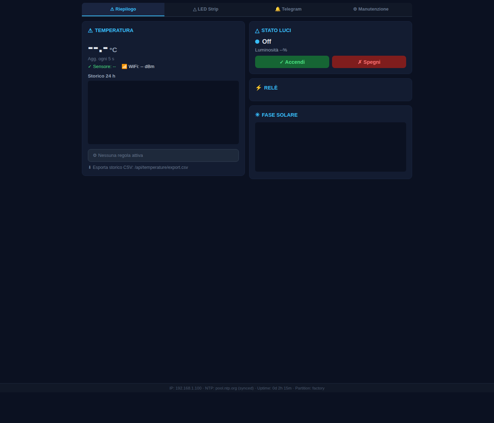
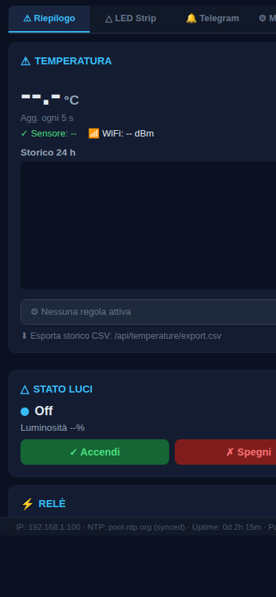
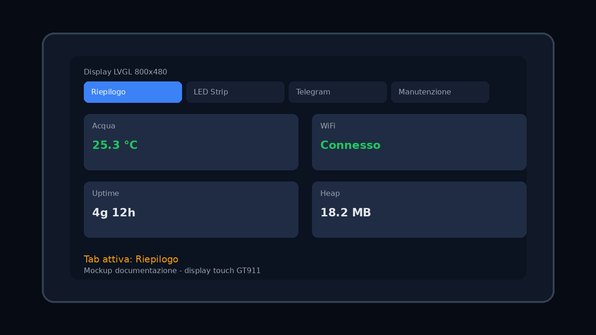
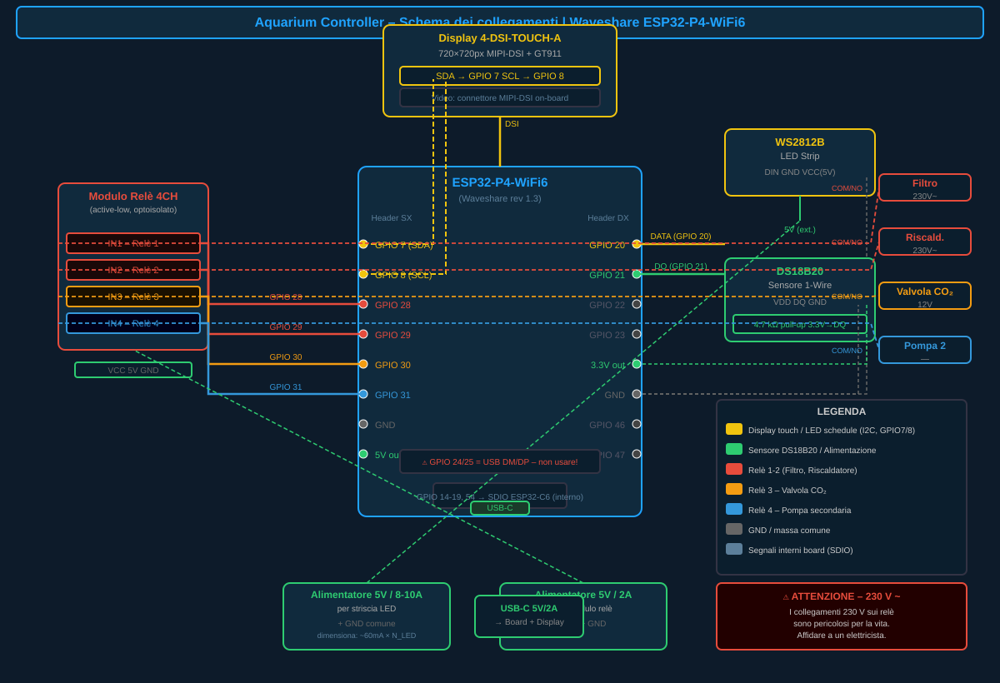

# 🐠 Aquarium Controller – ESP32-P4

Controller IoT completo per acquario d'acqua dolce basato su **Waveshare ESP32-P4-WiFi6**.  
Combina una **dashboard Web** accessibile da qualsiasi browser, un **display touch** LVGL da 720 × 720 px, notifiche **Telegram** e un motore di automazione avanzato — tutto in un unico firmware ESP-IDF.

> **Stack**: ESP-IDF v6.0 · ESP-Hosted (P4 + C6 WiFi 6) · LVGL v9 · FreeRTOS · HTTP/HTTPS embedded · PWA · Android (Jetpack Compose)

---

## 📸 Screenshot

### Web UI

| Riepilogo | Relè |
|:---:|:---:|
|  |  |

| Impostazioni | Mobile |
|:---:|:---:|
|  |  |

### Display touch (Waveshare 4-DSI-TOUCH-A)

| Home / Riepilogo | Automazioni |
|:---:|:---:|
|  |  |

---

## ✨ Funzionalità

### 🌡️ Temperatura
- Polling periodico **DS18B20** (1-Wire, GPIO configurabile)
- Media mobile per filtrare il rumore
- Calibrazione offset configurabile via `menuconfig`
- Storico giornaliero 24 h in RAM (campionamento configurabile, default 5 min)
- Esportazione CSV via REST API

### 🔌 Relè (4 canali)
- Controllo manuale e via **schedule orario** (fino a 4 slot indipendenti per relè)
- Nomi personalizzati persistiti in NVS
- Polarità active-low/high configurabile
- Callback multipli per notifiche a altri moduli

### ♨️ Auto-Heater (termostato)
- Attivazione/spegnimento automatico del relè riscaldatore
- Target e isteresi configurabili
- Protezione **runaway** (timeout + allarme Telegram se il relè rimane ON troppo a lungo)

### 💨 CO₂
- Controllo valvola solenoide sincronizzato allo schedule del relè luci (relè 0)
- **Pre-anticipo ON** e **post-ritardo OFF** configurabili (0–60 min)
- Configurazione indipendente via Web UI o REST API

### 🐟 Modalità Alimentazione
- Pausa relè configurabile (1–60 min, default 10 min)
- Notifica Telegram a inizio e fine sessione

### 🤖 Automazione Relè (event-driven)
- Fino a **8 regole** indipendenti persistite in NVS
- Trigger supportati: `TEMP_HIGH` · `TEMP_LOW` · `LIGHTS_ON` · `LIGHTS_OFF` · `FEEDING`
- Azione: accende/spegne qualsiasi relè per una durata opzionale (0 = permanente)

### 🐠 Profili Acquario
- Preset rapidi applicabili via Web UI o app Android durante il provisioning
- **Tropicale** – 26 °C, luci 08:00–18:00
- **Marino** – 25 °C, luci 08:00–20:00, doppio slot schedule luci con pausa
- **Piantato** – 24 °C, luci 09:00–17:00, CO₂ abilitata
- Al termine invia notifica Telegram con il riepilogo applicato

### 📱 Notifiche Telegram
- Allarmi temperatura (alta/bassa)
- Cambio stato relè
- Promemoria cambio acqua e fertilizzante
- Riepilogo giornaliero programmabile
- Messaggio di test

### 🌐 Web Dashboard (PWA)
- **Progressive Web App** installabile su smartphone
- Design dark con sfondo animato (bolle + scena subacquea SVG)
- Aggiornamento in tempo reale via **WebSocket**
- Tab: **Riepilogo** · **Relè** · **Cronologia** · **Impostazioni**
- Autenticazione con sessione cookie (login/logout)
- UI **mobile-first** responsive
- Configurazione guidata al primo avvio (setup wizard integrato)

### 🖥️ Touch Display LVGL v9
- Display 720 × 720 px MIPI-DSI, touch capacitivo GT911
- Dashboard a **5 tab**: Home · Temperatura · Relè · Automazioni · Cronologia
- Status bar fissa con ora, temperatura badge e stato WiFi
- Overlay allarme modale chiamabile da qualsiasi task

### 🔄 OTA (Over-the-Air)
- Aggiornamento firmware da **URL HTTP remoto**
- Upload diretto dal browser (**multipart form**)
- Controllo aggiornamenti via **URL release GitHub** con confronto versione
- Partizioni dual OTA con **auto-rollback** in caso di crash

### 🛰️ DuckDNS
- Aggiornamento automatico IP dinamico per accesso remoto

### 📡 mDNS
- Hostname configurabile (default: `aquarium`) → `aquarium.local`

### 🔒 Sicurezza
- HTTP Basic Auth + **session cookie** (POST `/api/login`)
- **HTTPS opzionale** con certificato self-signed embedded
- Credenziali modificabili a runtime via `/api/auth`

### 📱 App Android (companion)
- **Jetpack Compose** + Kotlin
- Setup wizard guidato: scansione WiFi → provisioning credenziali → profilo acquario → Telegram → DuckDNS
- Avvio diretto come **WebView** della dashboard una volta configurato

---

## 🧱 Hardware necessario

### Componenti obbligatori

| Componente | Descrizione | Note |
|---|---|---|
| **Waveshare ESP32-P4-WiFi6** | Board principale (ESP32-P4 + ESP32-C6 coprocessore WiFi 6) | rev 1.3 o superiore |
| **Sensore DS18B20** | Sensore temperatura 1-Wire | GPIO 21 + pull-up 4.7 kΩ a 3.3 V |
| **Modulo relè 4 canali** | Active-low, optoisolato | GPIO 28/29/30/31 (default) |
| **Alimentatore 5 V** | Per il modulo relè | dimensionare in base al carico |

### Componenti opzionali ma consigliati

| Componente | Descrizione | Note |
|---|---|---|
| **Waveshare 4-DSI-TOUCH-A** | Display IPS 720×720 MIPI-DSI + touch GT911 | collegato via connettore DSI on-board |
| **Valvola CO₂ + elettrovalvola** | Controllo CO₂ via relè | relè configurabile (default: indice 1) |
| **Riscaldatore acquario** | Controllato dal termostato firmware | relè configurabile (default: indice 1) |

### Schema pin di default

| Segnale              | GPIO | Header    | Note                            |
|----------------------|------|-----------|---------------------------------|
| DS18B20 DQ           | 21   | Destro    | 1-Wire + pull-up 4,7 kΩ a 3,3V |
| Relè 1 IN (Luci)     | 28   | Sinistro  | Active-low – usato da CO₂ e profili |
| Relè 2 IN (Riscalda) | 29   | Sinistro  | Active-low                      |
| Relè 3 IN (CO₂)      | 30   | Sinistro  | Active-low                      |
| Relè 4 IN (Filtro)   | 31   | Sinistro  | Active-low                      |
| GT911 I2C SDA        | 7    | Sinistro  | Touch display (riservato)       |
| GT911 I2C SCL        | 8    | Sinistro  | Touch display (riservato)       |
| MIPI-DSI             | —    | Connettore DSI on-board | Display 720×720  |

> ⚠️  **GPIO 24 e GPIO 25** sono DM/DP USB — non usare mai.  
> GPIO 14–19 e 54 sono riservati al bus SDIO interno verso il coprocessore WiFi ESP32-C6.

> Tutti i pin sono modificabili da `idf.py menuconfig → Aquarium *`.

📄 **Schema di collegamento completo:** [`docs/wiring.md`](docs/wiring.md)



---

## 🖥️ Touch Display UI – dettaglio

Il display **Waveshare 4-DSI-TOUCH-A** (720 × 720 px, IPS, MIPI-DSI, touch capacitivo GT911)
mostra una dashboard LVGL v9 a **5 tab** con stile _dark IoT dashboard_.

### Status Bar (tutti i tab)

```
┌────────────────────────────────────────────────────────────────────────┐
│  09:34              ⚠  25.4°C   [✓  OK]                      WiFi    │
│  (ora locale)        (temp)  (badge verde/arancio/rosso)      (icona)  │
└────────────────────────────────────────────────────────────────────────┘
```

### Tab 0 – 🏠 Home

Panoramica con temperatura attuale, stato relè attivi e CO₂.

### Tab 1 – 🌡 Temperatura

Arc gauge (15–40 °C) + spinbox target heater + stato riscaldatore.

### Tab 2 – 🔌 Relè

Stato on/off dei 4 relè con nomi personalizzati.

### Tab 3 – ⚙ Automazioni

Toggle per ogni automazione (auto-heater, CO₂, relay automation rules) + bottone **Avvia/Ferma Alimentazione**.

### Tab 4 – 📊 Cronologia

Grafico storico temperatura 24 h + log eventi recenti.

### Overlay Allarme

Chiamabile da qualsiasi task via `display_ui_show_alarm(msg, detail)`:

```
  ░░░░░░░░░░░░░░░░░░░░░░░░░░░░░░░░
  ░░  ┌──────────────────────┐  ░░
  ░░  │    ⚠                 │  ░░
  ░░  │  TEMPERATURA ALTA!   │  ░░
  ░░  │  Attuale: 29.3 °C    │  ░░
  ░░  │ [DISATTIVA]  [ OK ]  │  ░░
  ░░  └──────────────────────┘  ░░
  ░░░░░░░░░░░░░░░░░░░░░░░░░░░░░░░░
```

---

## 🌐 Web UI – dettaglio

La Web UI è un'applicazione **PWA** (Progressive Web App) installabile su Android e iOS.
Il frontend (HTML + CSS + JS + SVG) è **embedded nel firmware** e servito direttamente dall'ESP32-P4
senza necessità di SD card o server esterno.

- **Sfondo**: scena subacquea SVG animata con bolle CSS
- **Tema chiaro/scuro** commutabile
- **Aggiornamento real-time**: WebSocket push ogni 3 s
- **Autenticazione**: form login → cookie di sessione (24 h)

### Tab principali

| Tab | Contenuto |
|---|---|
| **Riepilogo** | Temperatura attuale, relè attivi, pausa alimentazione, stato sistema (SSID, heap, uptime, firmware) |
| **Relè** | Controllo on/off manuale, schedule orari (4 slot × 4 relè), nomi personalizzati, regole automazione relè |
| **Cronologia** | Grafico storico temperatura 24 h (esporta CSV), log eventi (relay, boot, allarmi) |
| **Impostazioni** | Auto-riscaldatore, CO₂, alimentazione, Telegram, DuckDNS, mDNS, timezone, OTA, backup/restore, profili acquario, factory reset |

---

## 🌐 REST API

Tutti gli endpoint richiedono autenticazione (Basic Auth o cookie di sessione).

### Sistema
| Metodo | Endpoint | Descrizione |
|---|---|---|
| `GET` | `/api/health` | Ping – stato sistema |
| `GET` | `/api/ping` | Ping leggero (unauthenticated, per captive portal) |
| `GET` | `/api/status` | Stato completo JSON (tutti i moduli) |
| `GET` | `/api/events` | Log eventi (relay, boot, allarmi) |
| `POST` | `/api/login` | Crea sessione cookie |
| `POST` | `/api/logout` | Invalida sessione |
| `POST` | `/api/auth` | Cambia username/password |
| `POST` | `/api/factory_reset` | Reset NVS e riavvio |
| `POST` | `/api/setup_done` | Segna setup guidato come completato |
| `POST` | `/api/profile` | Applica profilo acquario (`tropical` / `marine` / `planted`) |

### Temperatura
| Metodo | Endpoint | Descrizione |
|---|---|---|
| `GET` | `/api/temperature` | Temperatura attuale |
| `GET` | `/api/temperature_history` | Storico campioni JSON |
| `GET` | `/api/temperature/export.csv` | Esporta storico CSV |

### Relè
| Metodo | Endpoint | Descrizione |
|---|---|---|
| `GET` | `/api/relays` | Stato tutti i relè (on/off, nomi, schedule) |
| `POST` | `/api/relays` | Imposta relè (index, on/off, nome, schedule slot) |
| `GET` | `/api/relay_automation` | Regole di automazione relè |
| `POST` | `/api/relay_automation` | Salva regole di automazione relè |

### Automazioni
| Metodo | Endpoint | Descrizione |
|---|---|---|
| `GET` | `/api/heater` | Configurazione auto-heater |
| `POST` | `/api/heater` | Aggiorna heater (target, isteresi, relay) |
| `GET` | `/api/co2` | Configurazione CO₂ |
| `POST` | `/api/co2` | Aggiorna CO₂ |
| `GET` | `/api/feeding` | Configurazione + stato modalità alimentazione |
| `POST` | `/api/feeding` | Configura / avvia / ferma alimentazione |

### Telegram
| Metodo | Endpoint | Descrizione |
|---|---|---|
| `GET` | `/api/telegram` | Config bot (token, chat_id, flag notifiche) |
| `POST` | `/api/telegram` | Aggiorna configurazione |
| `POST` | `/api/telegram_test` | Invia messaggio di test |
| `POST` | `/api/telegram_wc` | Registra/promemoria cambio acqua |
| `POST` | `/api/telegram_fert` | Registra/promemoria fertilizzante |

### Manutenzione
| Metodo | Endpoint | Descrizione |
|---|---|---|
| `GET` | `/api/duckdns` | Configurazione DuckDNS |
| `POST` | `/api/duckdns` | Aggiorna DuckDNS |
| `POST` | `/api/duckdns_update` | Forza aggiornamento IP |
| `GET` | `/api/mdns` | Hostname mDNS |
| `POST` | `/api/mdns` | Imposta hostname mDNS |
| `POST` | `/api/ota` | Avvia OTA da URL remoto |
| `POST` | `/api/ota/upload` | Upload firmware dal browser (multipart) |
| `GET` | `/api/ota_status` | Stato aggiornamento OTA |
| `GET` | `/api/ota/release_url` | URL release GitHub configurato |
| `POST` | `/api/ota/release_url` | Imposta URL release GitHub |
| `GET` | `/api/ota/check` | Controlla se è disponibile un aggiornamento |
| `GET` | `/api/timezone` | Timezone configurata |
| `POST` | `/api/timezone` | Imposta timezone POSIX |
| `GET` | `/api/config/export` | Scarica configurazione JSON |
| `POST` | `/api/config/import` | Carica configurazione JSON |

### WebSocket
| URI | Descrizione |
|---|---|
| `ws://<ip>/ws` | Push stato JSON ogni 3 s a tutti i client connessi |

---

## ⚙️ Build & Flash

### Prerequisiti

- [ESP-IDF v6.0](https://docs.espressif.com/projects/esp-idf/en/v6.0/esp32p4/) installato e attivato
- Toolchain ESP32-P4 (`idf.py set-target esp32p4`)
- Python 3.8+

### Comandi

```bash
# Clona il repository
git clone https://github.com/Deddu3D/Aquarium-Controller-ESP32P4.git
cd Aquarium-Controller-ESP32P4

# Configura target e opzioni
idf.py set-target esp32p4
idf.py menuconfig

# Compila e flasha
idf.py build
idf.py -p /dev/ttyACM0 flash monitor
```

### Configurazioni principali (`menuconfig`)

| Menu | Opzioni chiave |
|---|---|
| **Aquarium WiFi Settings** | SSID, password WiFi |
| **Aquarium Web Authentication** | username, password Web UI (default: `admin` / `aquarium`) |
| **Aquarium Timezone Settings** | stringa POSIX timezone (default: `CET-1CEST,M3.5.0/2,M10.5.0/3`) |
| **Aquarium Temperature Sensor Settings** | GPIO DS18B20, intervallo lettura, offset calibrazione |
| **Aquarium Relay Settings** | GPIO relè 1–4, polarità active-low |
| **Aquarium Display Settings** | abilita display, GPIO I2C touch (SDA=7, SCL=8), timeout backlight |
| **Aquarium Auto-Heater Settings** | timeout runaway protection (default: 60 min) |
| **Aquarium Feeding Mode Settings** | relè pausa, durata default (default: 10 min) |
| **Aquarium HTTPS Settings** | abilita TLS (default: off) |
| **Aquarium WebSocket Settings** | intervallo push (default: 3000 ms) |

> **Prima configurazione**: imposta almeno SSID + password WiFi, oppure usa l'**app Android** che guida il provisioning completo via captive portal (AP mode `AquariumSetup`).

---

## 🧱 Architettura

### Hardware target

| Componente | Dettaglio |
|---|---|
| MCU principale | ESP32-P4 (dual-core Xtensa LX7 @ 400 MHz, no WiFi integrato) |
| Coprocessore WiFi | ESP32-C6 (WiFi 6 / BLE 5, collegato via SDIO) |
| Board | Waveshare ESP32-P4-WiFi6 rev 1.3 |
| Flash | 16 MB (partizioni: NVS 24 KB + OTA dual 6 MB × 2) |
| Display | Waveshare 4-DSI-TOUCH-A – 720 × 720 px IPS MIPI-DSI, touch GT911 |

### Flusso di avvio

```
1.  NVS init + restart counter
2.  Event log init
3.  Task Watchdog (45 s timeout)
4.  WiFi manager (STA → captive portal AP se fallisce)
5.  Timezone (NVS → default POSIX)
6.  SNTP sync (max 15 s)
7.  DS18B20 + history
8.  Telegram
9.  Relè controller + schedule immediato
10. Auto-heater
11. CO₂ controller
12. Feeding mode
13. Relay automation
14. Aquarium profile deferred (da provisioning Android)
15. DuckDNS
16. Web server HTTP/HTTPS
17. Display UI (task separato: LVGL + MIPI-DSI HX8394 + GT911)
18. OTA validate (auto-rollback)
19. Main loop (tick moduli ogni 5–60 s)
```

### Moduli (`main/`)

| File | Responsabilità |
|---|---|
| `main.c` | Bootstrap, callback relay → Telegram/event-log, loop applicativo |
| `wifi_manager.*` | STA/AP, captive portal di provisioning |
| `web_server.*` | HTTP/HTTPS server, PWA embedded, 40+ endpoint REST + WebSocket |
| `display_ui.*` | Touch UI LVGL v9 (5 tab, dark IoT theme) |
| `temperature_sensor.*` | Polling DS18B20, media mobile, calibrazione offset |
| `temperature_history.*` | Storico campioni in-RAM (288 punti × 5 min = 24 h) |
| `relay_controller.*` | 4 relè GPIO, nomi NVS, 4 slot schedule per relè, callback multipli |
| `relay_automation.*` | Motore regole event-driven (8 regole, 5 trigger, persistenza NVS) |
| `auto_heater.*` | Termostato automatico + runaway protection |
| `co2_controller.*` | Controller CO₂ con pre/post offset rispetto allo schedule luci |
| `feeding_mode.*` | Pausa alimentazione a tempo con notifica Telegram |
| `aquarium_profiles.*` | Preset tropicale/marino/piantato (heater + luci + CO₂) |
| `telegram_notify.*` | Notifiche Telegram via HTTPS (allarmi, relay, promemoria) |
| `duckdns.*` | Aggiornamento DDNS |
| `ota_update.*` | OTA via URL HTTP, upload diretto, check release GitHub |
| `timezone_manager.*` | POSIX timezone, lista preset, SNTP |
| `event_log.*` | Log eventi in-RAM (relay, boot, allarmi) |

### Componente locale

| Componente | Descrizione |
|---|---|
| `components/esp_lcd_hx8394/` | Driver panel MIPI-DSI HX8394 (override del managed component) |

---

## 📁 Struttura repository

```text
.
├── CMakeLists.txt
├── partitions.csv              ← OTA dual (ota_0 + ota_1, 6 MB ciascuna)
├── sdkconfig.defaults
├── README.md
├── android/                    ← App Android companion (Jetpack Compose)
│   ├── app/src/main/java/com/aquarium/controller/
│   │   ├── MainActivity.kt
│   │   ├── data/               ← PrefsRepository (SharedPreferences)
│   │   ├── network/            ← EspApiClient, PortalApiClient
│   │   └── ui/
│   │       ├── wizard/         ← SetupWizardScreen (6 step)
│   │       ├── WebViewScreen.kt
│   │       ├── WelcomeScreen.kt
│   │       └── ConnectScreen.kt
│   └── build.gradle.kts
├── components/
│   └── esp_lcd_hx8394/        ← driver HX8394 locale
├── docs/
│   ├── wiring.md
│   ├── wiring_diagram.svg
│   └── screenshots/
└── main/
    ├── Kconfig.projbuild       ← tutte le opzioni menuconfig
    ├── idf_component.yml       ← dipendenze managed (lvgl, ds18b20, gt911, cjson, mdns…)
    ├── CMakeLists.txt
    ├── main.c
    ├── web_server.c/h          ← HTTP/HTTPS + REST + WebSocket
    ├── display_ui.c/h          ← LVGL v9 touch dashboard
    ├── temperature_sensor.c/h
    ├── temperature_history.c/h
    ├── relay_controller.c/h
    ├── relay_automation.c/h
    ├── auto_heater.c/h
    ├── co2_controller.c/h
    ├── feeding_mode.c/h
    ├── aquarium_profiles.c/h
    ├── event_log.c/h
    ├── telegram_notify.c/h
    ├── duckdns.c/h
    ├── ota_update.c/h
    ├── timezone_manager.c/h
    ├── wifi_manager.c/h
    ├── server.crt              ← certificato HTTPS embedded
    ├── server.key
    └── www/                    ← Web UI (embedded nel firmware via CMake EMBED_TXTFILES)
        ├── index.html
        ├── style.css
        ├── bg.svg
        ├── manifest.json
        └── sw.js
```

---

## 🛠️ Troubleshooting

| Problema | Soluzione |
|---|---|
| **WiFi non connesso** | Verificare SSID/password; connettersi a `AquariumSetup` per il captive portal |
| **Telegram non invia** | Controllare token e chat ID; verificare SNTP sincronizzato |
| **Temperatura 0 / errore** | Verificare DS18B20 e pull-up 4.7 kΩ su GPIO 21 |
| **OTA fallisce** | Verificare URL binario accessibile dalla rete locale; partizioni dual OTA presenti |
| **Display nero** | Verificare `CONFIG_DISPLAY_ENABLED=y` e rev chip ≥ v1.0 (`CONFIG_ESP32P4_REV_MIN_FULL=100`) |
| **Web UI non carica** | Il firmware include la UI embedded – nessuna SD card necessaria. Verificare connessione WiFi e autenticazione |
| **Relè non segue lo schedule** | Verificare SNTP sincronizzato; controllare il fuso orario configurato |
| **CO₂ non si apre** | CO₂ segue il relè 0 (luci); verificare che relè 0 abbia uno schedule abilitato |
| **Bootloader rifiuta la board** | Aggiungere `CONFIG_ESP32P4_REV_MIN_FULL=100` a `sdkconfig.defaults` |
| **App Android non trova la board** | Assicurarsi di essere connessi alla rete WiFi `AquariumSetup` durante il provisioning |

---

## 🔒 Note di sicurezza

- **Autenticazione abilitata di default** (username: `admin`, password: `aquarium`) — cambiare le credenziali prima di esporre su Internet.
- **HTTPS opzionale** (`CONFIG_AQUARIUM_HTTPS_ENABLE=y`): usa TLS con certificato self-signed embedded; il browser mostrerà un avviso iniziale da accettare.
- Per esposizione su Internet si raccomanda un **reverse proxy** (es. nginx) con certificato Let's Encrypt valido.
- Le credenziali Web UI vengono salvate in NVS e possono essere modificate via `POST /api/auth`.

---

## 📄 Licenza

Distribuito con licenza **MIT**.  
Vedere il file `LICENSE` per i dettagli.
