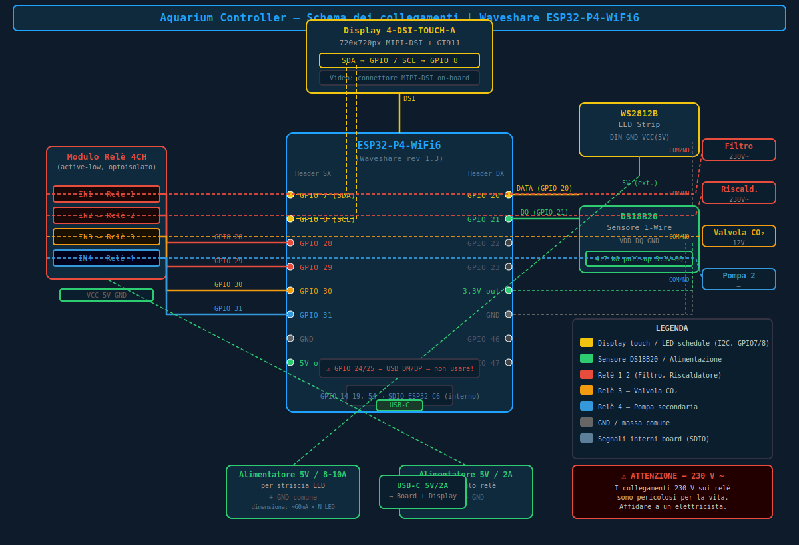

# 🔌 Schema dei collegamenti – Aquarium Controller ESP32-P4

Board di riferimento: **Waveshare ESP32-P4-WiFi6** (rev 1.3)

## Schema grafico



---

## Panoramica generale

```
                    ┌──────────────────────────────────────────────────┐
                    │          Waveshare ESP32-P4-WiFi6                │
                    │                                                  │
   Header SINISTRO  │                                   Header DESTRO  │
   ════════════════ │                                   ══════════════ │
   GPIO 2  ──────── │ ●                               ● ──────── GPIO 20 ──► WS2812B DIN
   GPIO 3  ──────── │ ●                               ● ──────── GPIO 21 ──► DS18B20 DATA
   GPIO 4  ──────── │ ●                               ● ──────── GPIO 22
   GPIO 5  ──────── │ ●                               ● ──────── GPIO 23
   GPIO 7 (SDA) ─── │ ●  [riservato display touch]    ● ──────── GPIO 26
   GPIO 8 (SCL) ─── │ ●  [riservato display touch]    ● ──────── GPIO 27
   GPIO 28 ─────── ►│ ● ── Relè 1 (Filtro)            ● ──────── GPIO 32
   GPIO 29 ─────── ►│ ● ── Relè 2 (Riscaldatore)      ● ──────── GPIO 33
   GPIO 30 ─────── ►│ ● ── Relè 3 (CO₂)               ● ──────── GPIO 46
   GPIO 31 ─────── ►│ ● ── Relè 4 (Pompa)             ● ──────── GPIO 47
   GPIO 49 ──────── │ ●                               ● ──────── GPIO 48
   GPIO 50 ──────── │ ●                               ●
   GPIO 51 ──────── │ ●                               ●
   GPIO 52 ──────── │ ●                               ●
   GND ──────────── │ ●                               ● ──────── 3.3 V
   GND ──────────── │ ●                               ● ──────── 5 V
                    │                                                  │
                    │  [Connettore MIPI-DSI] ──────────► Display 4-DSI-TOUCH-A │
                    │  [USB-C] ───────────── Programmazione / alimentazione    │
                    │  [GPIO 14-19] ────────── INTERNO: SDIO verso ESP32-C6    │
                    │  [GPIO 54] ─────────────  INTERNO: RESET ESP32-C6        │
                    └──────────────────────────────────────────────────┘
```

---

## 1 · Striscia LED WS2812B

```
ESP32-P4-WiFi6                          Striscia WS2812B
────────────────                         ────────────────
GPIO 20  ────────────────────────────►  DIN   (data)
GND      ─────────────────────────────  GND
                                         VCC  ◄──── Alimentatore 5 V
```

| Segnale   | ESP32-P4 | WS2812B | Note                                                     |
|-----------|----------|---------|----------------------------------------------------------|
| DATA      | GPIO 20  | DIN     | Segnale di controllo RMT                                 |
| GND       | GND      | GND     | Massa comune con l'alimentatore 5 V                      |
| VCC       | —        | 5 V     | Alimentazione esterna 5 V (non dal pin 3.3 V della board) |

> ⚡ **Alimentazione**: calcola ~60 mA per LED a piena luminosità bianca (RGB 255,255,255).
> Per 105 LED: ~6,3 A → usa un alimentatore 5 V da almeno 8 A.
> Collegare la massa dell'alimentatore **direttamente** alla striscia LED e al GND della board.

---

## 2 · Sensore temperatura DS18B20

```
ESP32-P4-WiFi6                          DS18B20
────────────────                         ─────────────────
3.3 V  ──────┬──────────────────────►  VDD  (pin 3)
             │ 4.7 kΩ
GPIO 21 ─────┴──────────────────────►  DQ   (pin 2)  ← linea dati 1-Wire
GND    ─────────────────────────────►  GND  (pin 1)
```

| Segnale | ESP32-P4 | DS18B20 | Note                                          |
|---------|----------|---------|-----------------------------------------------|
| DATA    | GPIO 21  | DQ      | Pull-up 4,7 kΩ a 3,3 V **obbligatorio**       |
| VCC     | 3.3 V    | VDD     | Alimentazione dal pin 3.3 V della board        |
| GND     | GND      | GND     |                                               |

> ⚠️ Il resistore di pull-up da **4,7 kΩ** tra DQ e VDD è **obbligatorio** per il corretto funzionamento del bus 1-Wire.
> In modalità parassita (senza VDD) la distanza massima del cavo è molto ridotta; si consiglia di non usarla.

---

## 3 · Modulo relè 4 canali (optoisolato, active-low)

```
ESP32-P4-WiFi6                         Modulo Relè 4CH
────────────────                         ───────────────────
5 V    ────────────────────────────►  VCC
GND    ────────────────────────────►  GND
GPIO 28 ───────────────────────────►  IN1  ──► Relè 1 (Filtro)
GPIO 29 ───────────────────────────►  IN2  ──► Relè 2 (Riscaldatore)
GPIO 30 ───────────────────────────►  IN3  ──► Relè 3 (CO₂)
GPIO 31 ───────────────────────────►  IN4  ──► Relè 4 (Pompa)
```

> I segnali IN1–IN4 sono **active-low**: il relè si attiva quando il GPIO va a 0 V (LOW).
> Il modulo deve essere alimentato a 5 V.

### Connessioni lato carico (rete 230 V ~)

```
                          ┌─────────────────────────────────┐
                          │      Relè singolo (es. Filtro)  │
                          │                                 │
 Fase (L) 230 V ─────────► COM (comune)                     │
                          │   │                             │
                          │   ├── NO (normalmente aperto) ──┼──► Filtro (fase)
                          │   │                             │
                          │   └── NC (normalmente chiuso) ──┼──► (non usato, o dispositivo sempre ON)
                          │                                 │
 Neutro (N) 230 V ────────────────────────────────────────► Filtro (neutro)
                          └─────────────────────────────────┘
```

> ⚠️ **PERICOLO ELETTRICO** – La rete 230 V è letale.
> Affidare i lavori sull'impianto elettrico solo a un elettricista qualificato.
> Usare morsettiere adatte alla corrente nominale del carico.
> Inserire sempre un fusibile sul conduttore di fase prima del modulo relè.

### Assegnazione relè predefinita

| Relè | GPIO | Dispositivo               |
|------|------|---------------------------|
| 1    | 28   | Filtro / pompa principale |
| 2    | 29   | Riscaldatore              |
| 3    | 30   | Valvola CO₂               |
| 4    | 31   | Pompa secondaria / altro  |

---

## 4 · Display touch Waveshare 4-DSI-TOUCH-A (720 × 720)

```
ESP32-P4-WiFi6                         Display 4-DSI-TOUCH-A
────────────────                         ─────────────────────────
[Connettore MIPI-DSI] ─────────────────  MIPI-DSI  (dati video 4 lane)
GPIO 7  (SDA) ─────────────────────────  GT911 I2C SDA  (touch)
GPIO 8  (SCL) ─────────────────────────  GT911 I2C SCL  (touch)
[Backlight] ─── hardware (nessun GPIO)   BL_EN
5 V / 3.3 V ──── via connettore DSI ───  VCC
GND ──────────── via connettore DSI ───  GND
```

| Segnale         | ESP32-P4       | Display      | Note                                   |
|-----------------|----------------|--------------|----------------------------------------|
| MIPI-DSI (4 ln) | Connettore DSI | DSI          | Cavo FPC flat da 40 pin incluso        |
| I2C SDA (touch) | GPIO 7         | GT911 SDA    | Pull-up interno abilitato              |
| I2C SCL (touch) | GPIO 8         | GT911 SCL    | Pull-up interno abilitato              |
| Backlight       | —              | BL_EN        | Controllato hardware dal display stesso |

> Il connettore MIPI-DSI trasporta anche alimentazione; nessun cavo di alimentazione separato richiesto per il display.

---

## 5 · Bus SDIO interno (ESP32-P4 → ESP32-C6 WiFi)

Questi pin sono **interni alla board** e gestiti automaticamente dal firmware tramite `esp_hosted`.
**Non collegare nulla a questi GPIO.**

| Segnale       | GPIO | Note                          |
|---------------|------|-------------------------------|
| SDIO_CLK      | 18   | Interno – non usare           |
| SDIO_CMD      | 19   | Interno – non usare           |
| SDIO_D0       | 14   | Interno – non usare           |
| SDIO_D1       | 15   | Interno – non usare           |
| SDIO_D2       | 16   | Interno – non usare           |
| SDIO_D3       | 17   | Interno – non usare           |
| C6 RESET      | 54   | Interno – non usare           |

---

## 6 · Mappa GPIO completa

### Pin usati dal firmware

| GPIO | Direzione | Funzione                        | Header   |
|------|-----------|---------------------------------|----------|
| 7    | I/O       | GT911 I2C SDA (display touch)   | Sinistro |
| 8    | I/O       | GT911 I2C SCL (display touch)   | Sinistro |
| 14   | I/O       | SDIO D0 → ESP32-C6 (interno)    | —        |
| 15   | I/O       | SDIO D1 → ESP32-C6 (interno)    | —        |
| 16   | I/O       | SDIO D2 → ESP32-C6 (interno)    | —        |
| 17   | I/O       | SDIO D3 → ESP32-C6 (interno)    | —        |
| 18   | I/O       | SDIO CLK → ESP32-C6 (interno)   | —        |
| 19   | I/O       | SDIO CMD → ESP32-C6 (interno)   | —        |
| 20   | OUT       | WS2812B DIN (LED strip)         | Destro   |
| 21   | I/O       | DS18B20 DQ (1-Wire)             | Destro   |
| 28   | OUT       | Relè 1 – IN1                    | Sinistro |
| 29   | OUT       | Relè 2 – IN2                    | Sinistro |
| 30   | OUT       | Relè 3 – IN3                    | Sinistro |
| 31   | OUT       | Relè 4 – IN4                    | Sinistro |
| 54   | OUT       | RESET ESP32-C6 (interno)        | —        |

### Pin **vietati**

| GPIO | Motivo                                   |
|------|------------------------------------------|
| 24   | USB D– (DM) – non usare mai             |
| 25   | USB D+ (DP) – non usare mai             |

### Pin liberi (header)

| Header    | GPIO liberi                                  |
|-----------|----------------------------------------------|
| Destro    | 22, 23, 26, 27, 32, 33, 46, 47, 48          |
| Sinistro  | 2, 3, 4, 5, 49, 50, 51, 52                  |

---

## 7 · Schema alimentazione

```
                    ┌─────────────────────────────────────────┐
                    │       Alimentatore 5 V / 8–10 A         │
                    └──────┬────────────────────────┬─────────┘
                           │ 5 V                    │ GND
                     ┌─────▼──────┐           ┌─────▼──────┐
                     │ Striscia   │           │  Comune GND│
                     │ WS2812B    │           │  (board +  │
                     └────────────┘           │   striscia)│
                                              └────────────┘
                    ┌─────────────────────────────────────────┐
                    │       Alimentatore 5 V / 2 A            │
                    └──────┬────────────────────────┬─────────┘
                           │ 5 V                    │ GND
                     ┌─────▼──────┐           ┌─────▼──────┐
                     │  Modulo    │           │  GND comune │
                     │  Relè 4CH  │           └────────────┘
                     └────────────┘

                    ┌─────────────────────────────────────────┐
                    │       USB-C 5 V / 1–2 A                 │
                    └──────────────────────────────────────────┘
                           │ (programmazione / alimentazione board)
                     ┌─────▼──────────────────────────────────┐
                     │       Waveshare ESP32-P4-WiFi6          │
                     │       + Display 4-DSI-TOUCH-A           │
                     └────────────────────────────────────────┘
```

> **Massa comune**: collegare i GND di tutti i moduli (board, relè, striscia LED, alimentatori) a un punto comune.

---

## 8 · Lista componenti

| # | Componente                        | Collegamento                       | Alimentazione |
|---|-----------------------------------|------------------------------------|---------------|
| 1 | Waveshare ESP32-P4-WiFi6          | Board principale                   | USB-C 5 V     |
| 2 | Striscia WS2812B (105 LED)        | DIN → GPIO 20                      | 5 V esterno   |
| 3 | Sensore DS18B20                   | DQ → GPIO 21 + R 4,7 kΩ a 3,3 V   | 3,3 V board   |
| 4 | Modulo relè 4 CH (active-low)     | IN1–4 → GPIO 28–31                 | 5 V esterno   |
| 5 | Waveshare 4-DSI-TOUCH-A (opz.)    | Connettore DSI + SDA/SCL GPIO 7/8  | Via DSI       |
| 6 | Filtro acquario                   | Via Relè 1 (COM/NO 230 V ~)        | Rete 230 V    |
| 7 | Riscaldatore acquario             | Via Relè 2 (COM/NO 230 V ~)        | Rete 230 V    |
| 8 | Valvola CO₂ (elettrovalvola 12 V) | Via Relè 3 (COM/NO 12 V)           | Esterno       |
| 9 | Pompa secondaria                  | Via Relè 4 (COM/NO)                | Esterno       |
